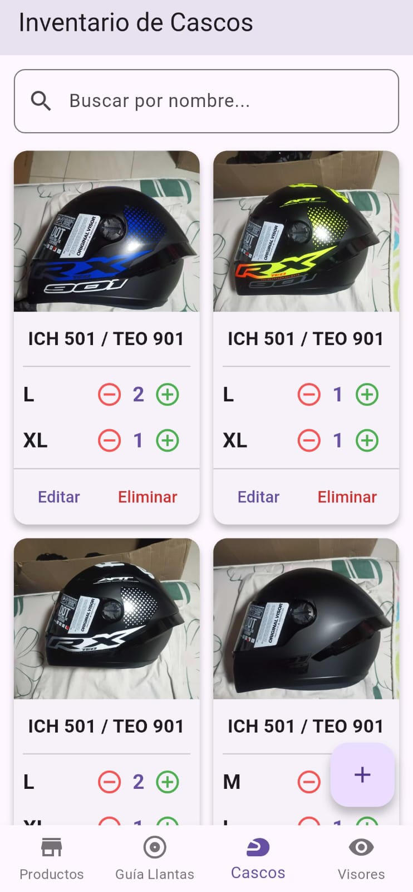
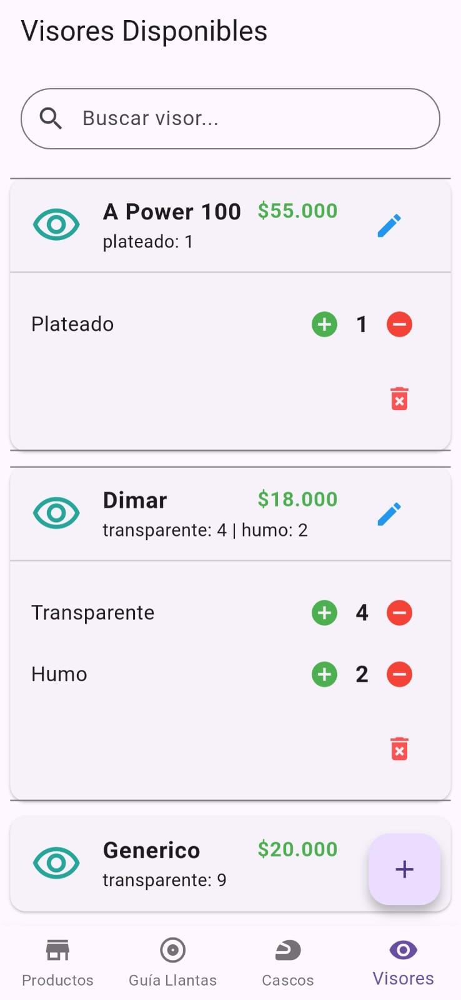
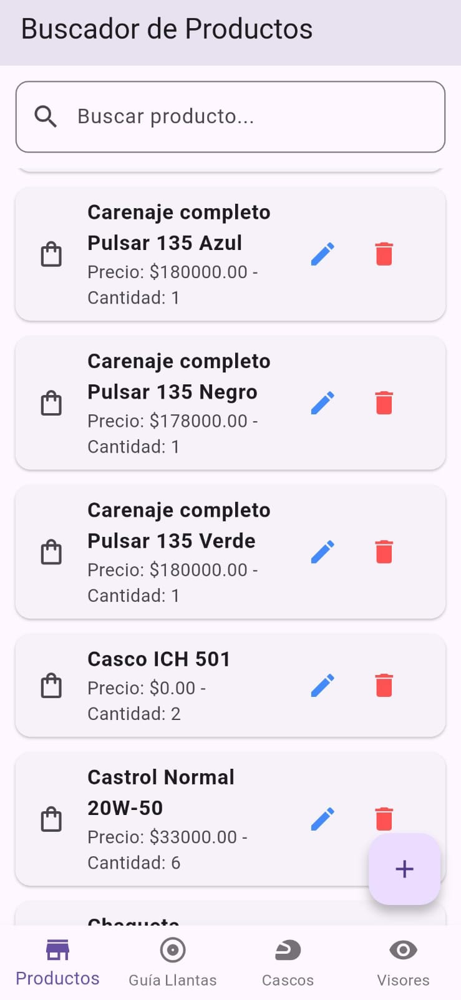
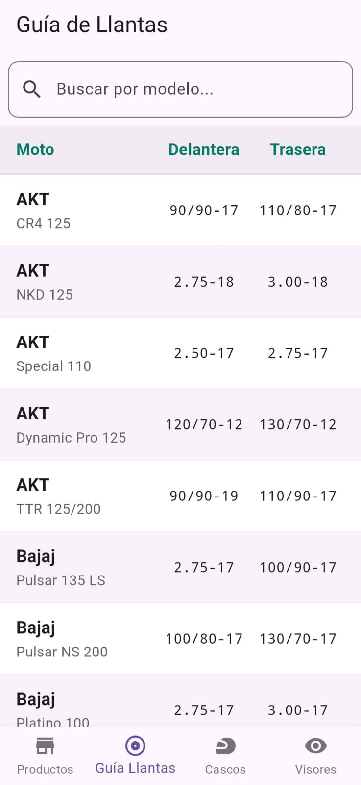
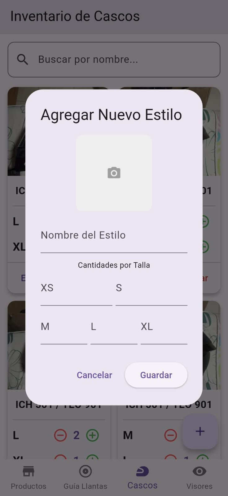
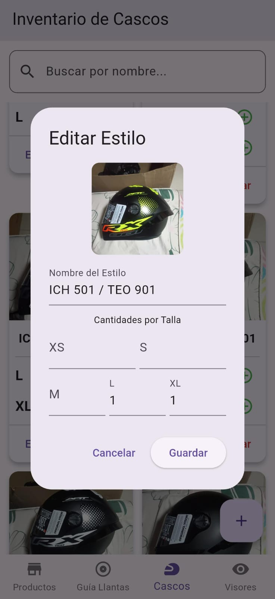
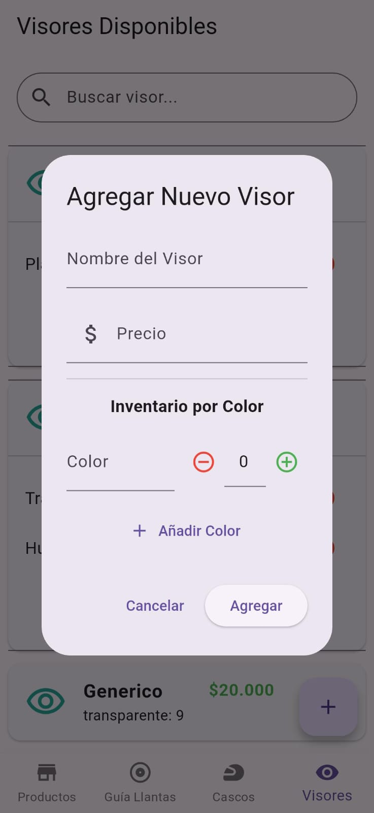
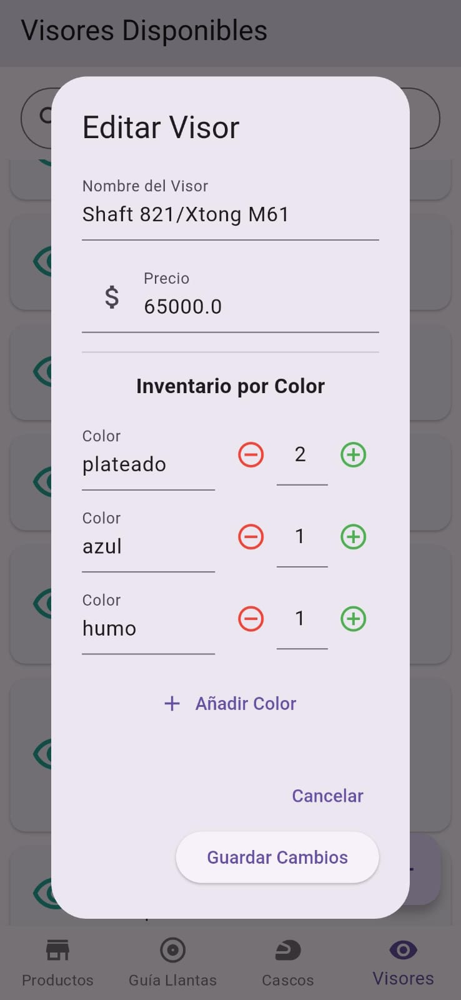
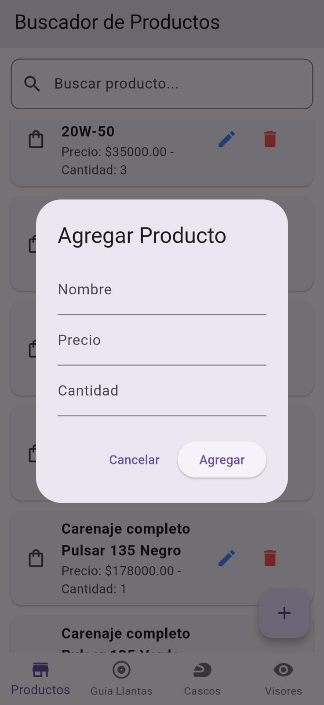
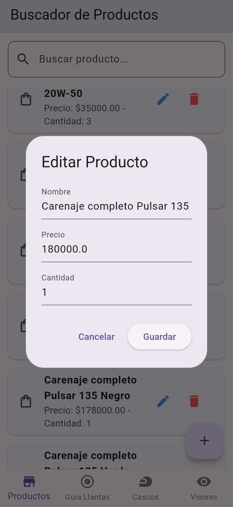

# 🏍️ Inventory Management App - Gestor de Inventario 🏍️  


> Una aplicación móvil integral construida con Flutter y Firebase para la gestión de inventario de un negocio de accesorios de lujo para motocicletas.

Este proyecto es una solución completa que aborda el desafío de gestionar un inventario con productos de naturalezas muy distintas. Desde productos genéricos hasta artículos con múltiples variantes como tallas y colores, la aplicación centraliza el control del stock, minimiza errores humanos y agiliza las operaciones diarias a través de una interfaz limpia, modular y reactiva.

---

### ✨ Tecnologías Utilizadas

| Tecnología | Icono | Descripción |
| :--- | :---: | :--- |
| **Flutter** | 🐦 | Framework principal para construir la interfaz de usuario nativa y multiplataforma. |
| **Dart** | 🎯 | Lenguaje de programación utilizado para desarrollar con Flutter. |
| **Firebase Firestore** | 🔥 | Base de datos NoSQL en tiempo real para almacenar y sincronizar los datos del inventario. |
| **Firebase Storage** | 📦 | Servicio para almacenar y gestionar imágenes de productos, como las fotos de los cascos. |
| **Image Picker** | 📸 | Librería para seleccionar imágenes de la galería o tomarlas con la cámara. |

---

### ✅ Características Principales

- **Navegación Modular Intuitiva:** La app se estructura en cuatro módulos claros accesibles desde una `BottomNavigationBar`: Productos, Guía de Llantas, Cascos y Visores.
- **Gestión de Productos Generales:** Un módulo CRUD completo para productos con stock simple. Incluye diálogos de edición con validación de formularios para garantizar la integridad de los datos.
- **Gestión de Inventario por Variantes (Visores):** Un sistema avanzado para productos con múltiples variantes de color. Utiliza tarjetas expandibles (`ExpansionTile`) para mostrar y gestionar el stock de cada color de forma individual.
- **Inventario Visual por Talla (Cascos):** Funcionalidad CRUD que permite subir una imagen por cada estilo de casco y gestionar el inventario específico para cada talla (XS, S, M, L, XL).
- **Guía de Llantas Interactiva:** Una herramienta de consulta rápida para encontrar las medidas de llantas correctas para cada modelo de moto, con búsqueda en tiempo real.
- **Reactividad y Consistencia de Datos:** Toda la aplicación utiliza `StreamBuilder` para reflejar cambios de la base de datos en la UI al instante y `FieldValue.increment` para operaciones de stock seguras.

---

### 📸 Capturas de Pantalla

Un vistazo a las vistas principales de cada módulo de la aplicación.

| Inventario de Cascos | Gestión de Visores | Productos Generales | Guía de Llantas |
| :---: | :---: | :---: | :---: |
|  |  | |  |

<br>

<details>
<summary><b>Ver Galería Detallada por Módulo (Click para expandir)</b></summary>
  
---
  
#### 헬 Módulo de Cascos
*Flujo completo: desde la lista principal hasta los diálogos para añadir y editar un casco.*

| Vista Principal | Añadir Nuevo | Editar Existente |
| :---: | :---: | :---: |
|  |  |  |

---
  
#### 🕶️ Módulo de Visores
*Vista de la lista expandible, formulario de creación y edición con gestión de colores.*

| Vista Principal | Añadir Nuevo | Editar Existente |
| :---: | :---: | :---: |
|  |  |  |

---
  
#### 📦 Módulo de Productos Generales
*Lista simple de productos, formulario de creación y diálogo de edición.*

| Vista Principal | Añadir Nuevo | Editar Existente |
| :---: | :---: | :---: |
|  |  |  |

---

#### 📋 Guía de Llantas
*Herramienta de consulta rápida con búsqueda en tiempo real.*
<p align="center">
  
</p>

</details>

---

### 🚀 Instalación y Configuración

Sigue estos pasos para ejecutar el proyecto en tu entorno local:

1. **Clonar el repositorio:**
    ```bash
    git clone https://github.com/tu-usuario/crud_flutter.git
    cd crud_flutter
    ```

2. **Instalar dependencias:**
    *Asegúrate de tener el SDK de Flutter instalado.*
    ```bash
    flutter pub get
    ```

3. **Configurar Firebase:**
    - Crea un proyecto en Firebase.
    - Habilita **Firestore Database** y **Firebase Storage**.
    - Configura la app con **FlutterFire CLI**:
      ```bash
      dart pub global activate flutterfire_cli
      flutterfire configure
      ```
    - Esto generará el archivo `firebase_options.dart` que debe ser importado en tu `main.dart`.

4. **Ejecutar la aplicación:**
    ```bash
    flutter run
    ```

---

### 🔮 Mejoras Futuras
- Implementar autenticación con Firebase Auth.
- Soporte para múltiples usuarios con roles.
- Generación de reportes en PDF.
- Filtros avanzados por categoría y marca.
- Integración con notificaciones push.

---

### 📄 Licencia
Este proyecto está bajo la licencia **MIT**. Consulta el archivo [LICENSE](LICENSE) para más información.

---

### 👤 Autor y Créditos
Desarrollado con ❤️ por:

**Julián David Rojas Román**  
- **GitHub:** (https://github.com/julian1416)  
- **LinkedIn:** [www.linkedin.com/in/julian-rojas-8b4b682b0
)  

¡Gracias por revisar mi proyecto! ⭐ Si te gustó, no olvides darle **star** al repositorio.
